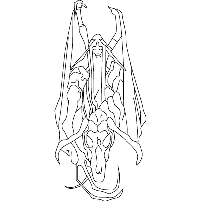
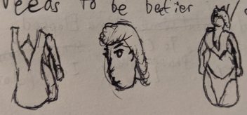

# Bleud
Bleud must lie to survive, physically and spiritually. She is not ready to tell the truth, for it would kill her.

## Bleud: name breakdown
Blew-d
Blew + lewd
# The Lie to Correct
Truth is death. Lies are uncomfortable.
# Story
The Original Teros wanted demons who could infiltrate Godsfont. With Torrin’s control over water and life he began crafting humanoids who could think, talk and manipulate. Bleud was his prototype. She had the correct shape but she had many pigmentation errors. Teros determined she was a failure and cast her aside. A “gift” to the Water Tyrant.
Sealed within a chamber, Bleud was unable to move but she could think. And she felt Torrin’s thoughts and reached out to her. Torrin guided her to have a sense of will and belief. Bleud felt bound by her master’s orders, but she began manipulating them and gaining some leeway in twisting the rules.
Torrin finds Teros and Surge and asks them to help her save Bleud. Her knowledge of the Water Tyrant’s Palace is invaluable.

# Personality
## Traits
### Quiet Hedon
In Human or Djinn societies, Bleud can amass a following rather quickly, and have them attend to her every need. She loves massages and getting fed water.

### Blunt
Bleud’s natural charm lets her be honest in many situations. She tells people what they need to hear, even if they don’t want to hear it.

### Restrained/Incomplete
Bound by her masters and knowing she is artificial, Bleud continues to seek a way to be free of her masters and actually independent. To aid this goal she seeks research from wise wizards and artificers.

## Tarot Card Challenge
### 8.  Strength
Blued endures the mental struggle of her master and the urge to help her new master. It’s difficult for her to subvert every command, but she plays a long term mental game. She knows her life is temporary either way.
### 10. Wheel of Fortune
Blued enjoys help and physical pleasure from others. But spiritual help and advice is difficult for her to accept. She’s not used to getting help or respect, so when someone treats her nicely without her prompts, it feels strange and discomforting to her.
### 14. Temperance
Moderation is difficult. Blued is a hedonistic manipulator, and she was made to quickly burrow her way into societies and become a spy. She follows her orders and does a good job. How does she subvert her own orders?
## Seven Deadly Sins Flaw
### 6. Envy vs Gratitude
Despite all of her debauchery, Blued knows she is Incomplete, and it gnaws at her.

Especially Teros, who she knows is also Incomplete, yet he has greater autonomy and doesn’t even know he is following orders.
# Looks
## Inspiration

# Writing
## 2021-12-01
- Teros confronts Bleud on their nature, hoping for another way out.
- Bleud reminds Teros of her duty and devotion to him, and how specific it is.

Teros waits for Bleud's attendants to leave the room. Does she need so many? All of them smiling as they leave - no argument, no fuss. Bleud got off the table and got dressed. "Thank you for your patience, Teros." She turns to him, unblinking so he may consume her truth.

Teros notices Quill float outside the room, to grant the illusion of privacy. Or maybe Quill doesn't want the truth. "Bleud, what am I? Are we the same?"

Bleud takes a step closer. "No, Teros. I am a prototype. An early attempt that failed. You are much more advanced, much more experiened... I see my half-truth has failed." Teros looks to her feathered bed. How much did that cost?

"I will attempt again. Teros. You and I are both artificial. Smooth sand given live by our Master. Each given agendas. I know yours, but you do not know your own." She finally took a breath and pushed the pain away.

Teros looked at her. "Wait, who is the master?" Bleud stumbles as Teros scoops down to catch her. "Are you under some kind of compulsion?" Teros kicks himself for asking that question. Bleud takes another breath and this time he has to help her onto the bed. "I'm sorry Bleud. I just... I just need to know. What am I doing here? I feel like I'm not even real, I'm just... observing this body as it moves. Like watching an illusion."

Bleud gathers the strength to drink from her pitcher of water. The pitcher costs about two months of salary. "Teros, I cannot answer these questions. I am forbidden. But know this: I will always follow Teros. That is my agenda."

She stands up so she may get close again and match his stare. He twists away again. She sweeps across the floor and kneels until she locks his gaze, like a spider crawling across the walls to reach the ceiling. "There is less than a month of peacetime. You must be ready. You will fulfill your agenda, but not your desires." She looks to the open vista. "That is our struggle."

Teros ponders what she meant, but it's too much. His mind wants to burst free, ignore her words and wander about the cosmos. But it can't. Godsfont needs him. What is his agenda? He tries to speak, but the words do not come. He needs fresh air.

Quill catches him outside Bleud's villa, catching his breath. He buries her words underneath his duty. He must protect Godsfont. Nothing else matters. "Quill. Let's begin a patrol."