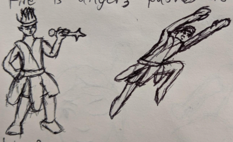

# Lini
Buries her past good and bad
Lini is proud of her future as the Heirophant’s daughter. But she can’t escape her thieving past, and she hides behind her faith instead of reconciling them.
Lini is a Fire Djinn, about 49 years old.

# Story
Lini was a fire djinn who was sold into a bandit camp. She yearned for freedom and sought the ways of Hiras, the goddess of freedom, joy and passion. The man who would become Hierophant adopted her, and she joined the Godsfont Guard as penance for her past. A demon attacked and poisoned her one night, spurring Teros into helping her as well as his kidnapped family.

Teros returns a year later, reviving Lini. She continues her duties as a Godsfont Guard, protecting the town and paying off her life debt to Teros.

# Nightmare
Lini wanders the Calm Plains. A vast land where the souls of the afterlife await their fate. The gods choose the strongest, the most pious who follow their morals. Lini continues to wander, rejected by good and evil gods. The sins of her life as a thief weigh heavily upon her, and she believes the gods will never forgive her. But her redemption attempt was enough to anger the gods of trickery, and now she wanders forever.

# Personality
## Lini’s masks: How does she present herself?
### Physical

#### External
Lini wears a dull gold, tight fitting dress. Her dress has several hidden compartments where she hides daggers, scimitars, whips and her healing staff. As well as loose items she finds and change she can offer to the poor.

She conceals this with a bulbous cloak bearing the symbol of Nirsi: The sun. It covers her left arm from the front and on the back it covers the back of her right arm. She's always able to conceal what she's holding at a moment's notice.

She wears black sandals and a headband, where she can store scrolls and small items.

#### Internal
Lini always remains alert to potential threats. Her life as a thief kept her watching her back in one way or another. She maintains a runner’s frame to remind her of the good parts of banditry: constant exercise. She enjoys the sun and maintains a torch look to establish her thanks and worship.

### Mental - How does Lini solve problems?
#### External
Look for routes and exits
Empathize with your targets
#### Internal
Outwit instead of Overpower
What would the gods Do?
### Ethical
#### External
Scrounge to Survive
Others’ Trust is a precious resource
Trusting others leads to betrayal
#### Internal
Praise the sun
Honor debts
Possessions are fleeting
Restless, try new things
Find Purpose

# What does Lini look like?
Somewhere between loosely-dressed sun worshipper and exciting dancer, Lini’s black hair rises and wavers. Her skin is a dull red, and she wears loose clothing.

Lini’s dress has several loose layers of cloth held by a golden belt. Her top has two straps around her shoulders. She’s barefoot here, and her black hair is held by a headband.

## Physical Silhouette
Her head should look like a torch. Her hair is wavy and points away from her forehead. Her loose clothing looks similar to a ringed torch.

## Music Inspiration
Street Fighter V – Theme of Rashid
His theme feels like the sun, piercing the night. Lini dances as she holds her staff high, its healing light washing away her friends’ fear and weakness.

## Facial drawings

- Square irises

- Torch shaped head
- Triangular Flap ears 
- Sun earrings 
- Hair begins above eye level.

## Tarot Card challenge
### 18. The Moon
Lini’s life as a bandit still bothers her. She did it to survive and escape punishment, but she never forgave herself for stealing from others. She remembers the joy of possession and it frightens her. Her brush with death has resurrected these fears. Will she die burdened with sin? Or will her life as the Hierophant's daughter make amends?
### 14. Temperance
Lini strives to balance the needs of many when negotiating. She wants everyone to have something, and carries a deep empathy during negotiations. People turn to her for guidance when the Hierophant isn’t around. It makes her a bit stubborn and obsessed when she can’t get people to reconcile, though.
### 10. Wheel of Fortune
Lini’s life comes in ebbs and flows, She knows when times are good, bad times are approaching. But she never gives up hope, because it’s only a matter of time before life improves. She’s optimistic in nature, sometimes to an annoying degree. But that optimism kept her alive when she was a thief.
## Seven Deadly Sins Flaw
### 3. Greed vs Charity (or Generosity)
Lini loves praise. She’ll do whatever it takes to get your approval, even at cost to herself. She claims she’s selfless, but really she just wants to be the center of attention.

Lini loves to help, but is it because she’s generous? Or is she a glory hound?

# Free Writing

## 2022-01-02

Flowers are so rare in this area. My father keeps a garden on top of his tower full of them. When I was young, I would sleep under the cold night to watch them bloom during sunrise. It was one of the few joys I had. A quiet moment to reflect.

My father was quite strict when I first met him. His handlers watched my every move. They had many reasons to not trust me, of course. Every day I sought an escape route, or at least a way to pawn my, er, earnings. Every day they found a new possession on me. I professed ignorance, but the owners remembered my face.

He sat me down one day and said I could not leave the tower. Said it was for my own good. The merchants guild grew tired of me and my exploits. They were tired of the Hierophant making excuses and protecting his daughter. They would throw me in prison if I so much as picked a grain of sand off of them.

Locked in my own home, I was so irritable. I snuck out anyway and visited the other neighborhoods. I felt so comfortable there. Everyone understood material loss. They also cherished home, and reminded me not to take it for granted. I spoke to them until the night. Then I returned to my prison and slept until the flowers bloomed.

Eventually the merchants' guild calmed down, or maybe they had other quibbles to deal with. It didn't change my routine much, I stayed away from them unless father had to show me around. My nights were still with the poorer neighborhoods, encouraging them to stick together. My days, though, turned to religion. I felt Nirsi tried to protect me for those years, and I owed her. I read and learned all that I could.

When I finally recovered, the flowers had withered. Father was no good at being delicate. He was also quite worried I wouldn't survive the poison. But here I am, blooming against the morning sun. Whose lives can I help improve today?
