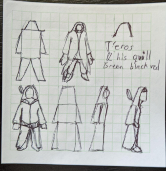

# Teros
The Main character is a clone of the original wandering wizard. Unlike the original, he wasn't corrupted with demonic power
and continues to protect the village of Godsfont as the Captain of the Guard.
He also has impostor syndrome as he's worried people will discover he is not Human
but rather a Simulacrum of a Human.

## Links to other pages
- Original Teros
- Godsfont
- Lini
- Gloria
- Fracta
- Barubary
- Vale
- Quill
## Backstory
### Early life
- Born into poverty
- Sold to a drunk mage who recognized his innate magic
- Read the mage's books and taught himself to survive
- Created Quill, his familiar companion
- Recognized by Imperial Magic Scholars, recruited into school
### Friendship and Rise to Archmage
- Specialized in transportation and dimensional magic
- Rose to top of class
- Joined military as payment for his free tuition
- Rose through the ranks; known for his tactical skill

### The Sojourn
With his family missing and Lini poisoned, Teros decided to pause his time as Captain
so he could focus on rescuing his family and finding the cure to Lini's poison.

Gloria became the interim Captain while he began research. He found a promising lead:
the Night Lotus, an extremely rare plant. Its restorative properties were so powerful
it was nearly hunted to extinction. Teros wishes everyone goodbye and sets off to collect it.

As he reaches the plant, he comes to a stop as his programming takes over.
Leave Godsfont for a year and destabilize the city. The town would be hit hard without
his guidance, giving the enemy plenty of time to steal and destroy it.

## Gameplay
### Team Role
#### Transporter
Teros uses his dimensional magic to quickly travel around the area.
He moves faster than most humans, and he can teleport himself short distances.
Eventually he can bring people to him, either rescuing them or warping them ahead.

#### Assaulter
Teros has strong physical and magical attacks.
- He is trained to use a spear
- His connection with Quill gives him magical portals and dimensional blasts.

Eventually he can learn to counter with magic and AoE with his spear.
Most magic cannot counter, and most physicals are single target.

## Teros's Masks
Did you know Terios means Mirror in Greek? I didn’t until afterwards. (July 7, 2020)

### Physical
#### External
Like Teros, he is a dark skinned man of average build who wears green robes. 
He crafted a companion of pure magic and he calls it Quill.  
His movement is careful and controlled, using magic to propel him short distances.

#### Internal
Teros likes his cowl on as a sign of fashion and pride.
He keeps his body fit, but not muscular.
He tries not to stray too far from what the Original Teros was.
Terrified his physical form will betray him if he strays too far.

### Mental
#### External
Teros was trained to be a warmage.
He learned how to blend physical and magical skills alongside war tactics and strategy.
In his career as Archmage, he fought in multiple battles and wars, picking up information along the way.

#### Internal
Teros is quick with analysis, but he tries to get input from his nearby peers and allies.
Sometimes they have a piece of information or an idea he had not considered.
He learned that war is a team effort - the outliers are the easiest to remove.

### Spiritual
#### External
The original Teros simply followed his master’s orders when he was young. He believed in intelligence as the ultimate equalizer: a poor man was rich while a rich fool would soon become poor.

The new Teros was directed to simply help his allies and follow his master’s orders. 
As Teros wore the mask and began to realize he was the mask, the Impostor Syndrome sank in.

#### Internal
Teros fears rejection for being an impostor. He will do all he can to hide his identity as a clone.

- Skips parties and social events so he can spend time in solitude rather than risk exposing himself
- Hide his low power level and claim he was caught off guard/spells weren't ready/he's still recovering from the year-long sojourn
- When speaking to someone close to the original Teros, he withdraws in shame, knowing his presence must be insulting to them.
- Often wonders "What would Teros do?" so he doesn't arouse suspicion. Since he doesn't fully know what

##### Who am I?
One one aspect of Water Tyrant has over Teros, is that she can always relate to him as they are both dealing with cloning blues. No matter what they do, they will always be compared to the original.

Teros always thinks about what the original would do. "This is something he would like? Is this something he would hate?" And the Original's role as the captain of the GodsFont Guard means that Teros will continue leading to maintain appearances.

It takes him a while. But he eventually, he wears the mask. He protects for the sake of protecting and not because he needs to keep up appearances. He doesn't need to hide himself as the "real" thing.

That's a big difference between the two: In the end. Teros is willing to die for his cause. He knows that the story is much bigger than him. He also knows that this will honor the original's name if he protects the land.

Friendships also define their behavior. For Teros, many of his allies, never knew the original. Many of them speak about their purposes and their humanity. They ask if they are doing the right thing.

With these converstaions, Teros realizes that the world is much bigger than himself. When people do discover that he's not the original, it's less of about who he "should" be. This liberates his actions and he can figure out what he wants to do in the world. He's willing to ask the question. "Who am I? And what do I want out of this" rather than slavishly following the original's actions?

# Visual Look
Main color is Green. Add Black and Red accents.

## Highlights
Needs a pointy high collar that folds into his neck.
Needs to simplify his costume.

## Historical Costumes
### Sonnike
https://upload.wikimedia.org/wikipedia/commons/f/f3/GuerriersSarrakholais.jpg
### Sahelian kingdoms
Grasslands south of the Sahara. Check out the green man in the lower left corner.

https://en.wikipedia.org/wiki/Sahelian_kingdoms#/media/File:Geschichte_des_Kost%C3%BCms_(1905)_(14580574910).jpg
### Mali
Western Africa, mid 13th to 15th century

https://pin.it/4kVExNK

### Tuareg
Sahara African ethnic group. Renowned for warrior strength until the invention of the firearms.

https://pin.it/2MG0t1S
https://pin.it/yLknCu6

### Somali
https://pin.it/4LKWhrA

# Tarot card challenge
Teros and Corrupted Teros have the same tarot cards, in the same direction.

## 8. Justice
Justice Reversed: Inner Critic

Teros constantly questions his struggle about the value of knowledge. He constantly questions the true value of knowledge, and how much emphasis he places on it. Is it the end all, be all? Is it sometimes better to work on instinct? Is too much information a bad thing?
## 3. Empress
Upright: Creativity

Teros has tried to branch beyond laws and information, hoping to use his creativity to help him be more innovative.

He thanks his calligraphy hobby for his rise to the rank of Mage General. It inspired him to think about ways to invent new spells and break the rules in various ways. He was a bit controversial for wasting time in the arts rather than planning war strategy, but it sped up the meetings immensely.

Quill is a unique familiar he crafted, and he uses ink as his motif.
## 21. The World
Reversed: Losing sight of the goal

The cloned Teros was made with incomplete goals - he has no memory of his family. He finds his friends and rebuilds the Godsfont Guard, he finds purpose again. But as he realizes his origin he wonders about his purpose - to protect the town, defeat the corrupted, or retain knowledge.

# Seven Deadly Sins flaw:
## 4. Sloth vs Diligence
Teros questions his search for more knowledge- is he learning for learning’s sake? Are there topics he could learn more about but he’s dismissed them out of hand?

Teros fights a mission between being efficient and wasting his free time.

# Writing
## 2021-12-09
One one aspect of Water Tyrant has over Teros, is that she can always relate to him as they are both dealing with cloning blues. No matter what they do, they will always be compared to the original.

Teros always thinks about what the original would do. "This is something he would like? Is this something he would hate?" And the Original's role as the captain of the GodsFont Guard means that Teros will continue leading to maintain appearances.

It takes him a while. But he eventually, he wears the mask. He protects for the sake of protecting and not because he needs to keep up appearances. He doesn't need to hide himself as the "real" thing.

As for the water tyrant, she just hates being compared to Torrin. She may have at one point thought, "what would Torrin do?" But she's tired of restricting herself. She's tired of Torrin's neutral responses of measured, calm self-restraint. She has the power, she has the abilities, she has control. And why not flaunt it? Especially against those who would look down on her for being a duplicate.

It helps her push away the thought that one day, Torrin will conquer her and take her back.

That's a big difference between the two: In the end. Teros is willing to die for his cause. He knows that the story is much bigger than him. He also knows that this will honor the original's name if he protects the land.

Compare and contrast with the Water Tyrant. She's going to die, miserably, as a duplicate. Claiming that she never got to exist as a separate feature that even with her power, even with or wealth, even with her army, even with a drastically different alignment from Torrin. She is always bound to Torrin. She never found her escape.

Friendships also define their behavior. For Teros, many of his allies, never knew the original. Many of them speak about their purposes and their humanity. They ask if they are doing the right thing.

With these converstaions, Teros realizes that the world is much bigger than himself. When people do discover that he's not the original, it's less of about who he "should" be. This liberates his actions and he can figure out what he wants to do in the world. He's willing to ask the question. "Who am I? And what do I want out of this" rather than slavishly following the original's actions?

The Water Tyrant, conversely has no allies. Just the Corrupted Teros who uses her as a vessel. He doesn't care about her personality. He doesn't care that she seeks purpose. He just says, "this is who you are" and he has not allowed her to ask the question.

This causes her to lash out at others. She represses the rage that she feels over this because she cannot strike her from Master. She becomes the tyrant and she soon begins conquering all in her attempts to fix to well the rage inside of her without actually confronting it.
## 2021-12-01
- Teros confronts Bleud on their nature, hoping for another way out.
- Bleud reminds Teros of her duty and devotion to him, and how specific it is.

Teros waits for Bleud's attendants to leave the room. Does she need so many? All of them smiling as they leave - no argument, no fuss. Bleud got off the table and got dressed. "Thank you for your patience, Teros." She turns to him, unblinking so he may consume her truth.

Teros notices Quill float outside the room, to grant the illusion of privacy. Or maybe Quill doesn't want the truth. "Bleud, what am I? Are we the same?"

Bleud takes a step closer. "No, Teros. I am a prototype. An early attempt that failed. You are much more advanced, much more experiened... I see my half-truth has failed." Teros looks to her feathered bed. How much did that cost?

"I will attempt again. Teros. You and I are both artificial. Smooth sand given live by our Master. Each given agendas. I know yours, but you do not know your own." She finally took a breath and pushed the pain away.

Teros looked at her. "Wait, who is the master?" Bleud stumbles as Teros scoops down to catch her. "Are you under some kind of compulsion?" Teros kicks himself for asking that question. Bleud takes another breath and this time he has to help her onto the bed. "I'm sorry Bleud. I just... I just need to know. What am I doing here? I feel like I'm not even real, I'm just... observing this body as it moves. Like watching an illusion."

Bleud gathers the strength to drink from her pitcher of water. The pitcher costs about two months of salary. "Teros, I cannot answer these questions. I am forbidden. But know this: I will always follow Teros. That is my agenda."

She stands up so she may get close again and match his stare. He twists away again. She sweeps across the floor and kneels until she locks his gaze, like a spider crawling across the walls to reach the ceiling. "There is less than a month of peacetime. You must be ready. You will fulfill your agenda, but not your desires." She looks to the open vista. "That is our struggle."

Teros ponders what she meant, but it's too much. His mind wants to burst free, ignore her words and wander about the cosmos. But it can't. Godsfont needs him. What is his agenda? He tries to speak, but the words do not come. He needs fresh air.

Quill catches him outside Bleud's villa, catching his breath. He buries her words underneath his duty. He must protect Godsfont. Nothing else matters. "Quill. Let's begin a patrol."
## 2021-11-27
- Teros feels embarrassed a lowly bandit could stop him, so he puts up a brave face
- Vale plays with the bandits, treating them as lessers.
- Fracta is desperate, blindly hopeful this will turn out well

"Give me the herbs already!" Fracta raised a stone wall behind her.

This mage Teros evaded her for two days, but no more. Walls on all sides. No roof so nowhere to hide. The sun shines on everyone, and Fracta feels her luck. Good luck.

Teros catches his breath and holds his spear. Fatigue seeps through his posture, weighing his arms, knees and back. Quill pulses on the spearpoint, and he nods. *Right. Can't show weakness.* "Come and get it, then!" Teros beckons with his free hand. The two archers take aim. Fracta points and gives the order.

Lightning fells the archer on Teros's right. Fracta watches her luck fizzle as another human floats in. Skin is pale, skin withered. Wooden staff. Cloaked in wind and lightning. Fracta recognizes Vale, and Vale recognizes Teros. Why didn't intel warn me?

"Teros! Stop playing with 'em. Barely worth the magic." She swoops in and points her staff at the other bandit. A gout of flame reaches out, but the bandit quickly climbs over the wall. "I love when they run- makes it more exciting. I'll catch 'em. Take care of this idiot."

"Right. Good to see you again-" Teros watches Vale fly after the other bandit. She didn't even notice the arrow in his side. He made a note to tell her later.

## 2021-11-25
- Teros chooses to hide his shame and suffer suspicion.
- Vale holds onto a false hope, defying logic.
- Surge loses faith in Vale and distrusts Teros more.

"Vale, there you are." Surge approaches like a dog glad to see his master. As he turns the corner, he barely conceals his fangs. "Teros." Strategy had given way to an awkward pause.

"Surge, Teros and I were discussing tomorrow's raid. Come on." She waves the Undine over to the map. "Most of our troop will serve as a distraction. Draw the weaklings out. Our target is the leader, Korsin and his benefactor. Fracta said we take them out, she can retake control of the bandits and order them to surrender." She looks to Teros, he nods. She looks to Surge and his distaste is obvious to them both.

"R-right. How do we know they won't have a reserve troop?" Surge looks Teros right in the eye. "How do we know you haven't given us away? Maybe they're lying in ambush, right outside the camp." Quill forms into a shocked expression before hovering between the two.

Teros gently moves Quill aside. "Surge, my goal is to rescue the people they kidnapped. You know this. The easiest way is to disrupt their chain of command so we can secure the hostages in the ensuing chaos." His words slow, calculated for logic, ignorant of Surge's true questions. "And I am the Captain. Why would I jeopardize the mission?"

Surge's eyes scan over to Vale's. Her eyes are on the floor. "Vale, did you ever finish the analysis?" She looks up at him *not now*. He looks to Teros. "When you... rescued me from Barubary, you bled. I asked Vale to analyze your blood. I don't know who you are, exactly, but-"

Vale taps the ground with her wooden cane. "Okay Surge. The results were... inconclusive." Both look at her, she isn't looking back. "That's not true. The blood was a perfect match. Like he hadn't aged a day since we drew it last time." She keeps her gaze on the walls. Surge knew his Guardian all his life; she was hiding her suspicions with her trademark pacing routine. "So... it's him. It's Teros."

Surge sighed. "The last 2 people I met who claimed to be Teros were very manipulative. They relied on magic to twist my mind into compliance. They failed because they looked like him, but they couldn't act like him." He looks through Teros.

Teros cleared his throat. "Once again, I am sorry they targeted you like that. But I am him." *I must be him.* "I am Teros. Vale never told me about the blood test, how could I fake that?" Teros lifts the weight of his lies. Too many lives will be crushed underneath its weight.

"...Very well. I will travel with you if you want to the bandit camp." Surge turns away from the lies. "Good night, Vale." Surge moves away from his trust. This thing got to Vale, his Guardian. Maybe she was tired of searching. Maybe she was tired of failure. Maybe she didn't take his stories for granted. But Surge would not let anyone get to him again.
## 2021-11-12
- The bandits surrender
- Godsfont Guard give him the rest of the after action report
- Alone, he looks at himself in a mirror
- Checks his smooth hand, "Who am I?"

Teros kept his spear drawn and ready. The blade's energy hissed through the silence as the bandit leader fell to his knees. "I surrender! We all- we all surrender!" The surviving bandits dropped their weapons and the Godsfont Guard moved in to disarm and arrest them.

"You made a wise decision." Teros bound the leader's arms and helped him stand up. "Further cooperation will help reduce your punishment."

Then came the hard part: the after action report. Against the sunset, lower ranking guards would walk in, thank him for his leadership, and give their report. Only Teros sat down. The guards weren't chained to their duty. They left for the day or began their night shift - no need to stick around.

Once they left, Teros digs through the mountain of notes. He filters out wild guesses, misinterpretations, and prejudice to write just the facts. The bandits thought the merchant was an easy target. A scouting bandit set off a silent alarm. Teros was inspecting a nearby smithery when he caught the alarm and mobilized the troops.

Teros continues compiling until hissing breaks his concentration. Quill is almost inside his right ear when his mind catches up to his senses. "I'm so tired... I've been up for too long, eh?" Quill responds to his query with a quick shake up and down. "Bedtime, yes."

He enters the bedroom and looks at the mirror. Who is that man staring back at him? Someone bought it for him, someone important. Quill points to the empty ceramic basin next to his bed. It is not his bathing basin. Neither is the smaller one outside the main bedroom.

The headache gets worse. Teros blocks out the basins and looks back at the reflection. Who is that? Teros holds up his right hand. Unmarred, no scars. But it was scarred in a magical fire long ago. Before he mastered the art. When did he have time to heal it this well? It didn't make sense, the reflection mumbled. Teros nodded.

"Who... who am I?"

## 2021-11-10
Dame Gloria is always early for these update meetings. One of the few times her helmet is off. She stands to attention and heaps respect upon me. "Captain, good to see you."

An awkward pause before I can point back to the table. "You can be seated." Quill buzzes about my head as I move to the head of the table. Gloria returns to her seat, checks the alignment against the table, then grasps her precious helmet.

The sunset streaks red and golden rays through the open windows. It's beautiful, except for the shine off of Gloria's armor. Quill hovers overhead and soaks the sunlight instead. Thanks, Quill.

Torrin and Serge slither in next. Torrin is exhausted, she's dragging her leg stumps across the sand. Serge is lending his shoulder to help his mother. He's a good boy. I can't help but smile. "Lady Torrin. Sir Serge." Dame Gloria greets them first.

Serge bows to her. "Good to see you, Dame Gloria. I trust you had a good patrol? My mother and I-" Gloria raises a hand to cut him off. "You can tell the captain once we begin."

## 2021-11-01
- Teros wanders on a walk
- Puts feelings together "Who am I?"
- Maybe he should suppress?
- But he thirsts for more knowledge
- Too scared to revel but driven to help

Silence comforts him, while footsteps irritate him. Teros stops long enough to reinvite silence. The sun is always welcome, even as it retreats below the horizon. Maybe celestial bodies are afraid.

Godsfont thanked him for service yesterday. The earth djinn was unstable, angry. Claimed he was underpaid. He probably was; the merchant was quite rude. But violence begets violence. Hopefully his time in jail will calm him down.

"Is this who I am?" Teros looks at his hands. Are these even his hands? He takes off his gloves and observes the grooves in his palms. No scars. He remembers the failed days trying to form Quill. It backfired so many times. Now his hands are too clean- when did he heal?

After breaking up a gang of Ardons, Vale came to congratulate him. "Hey Teros, good job. Took you a little longer than I thought." She paused for a moment. Long enough to begin analyzing him. It was her habit of scanning too much. But she never made a move.

Teros was too perfect for his own good. Small scars, alchemical burns, injuries from cutting himself off in incomplete portals- all gone. Vale was suspicious. She must have figured it out. Why didn't she say anything? He recalled his response: "Just trying to keep the peace."

Teros sat down and let the cool air blow over him. It would be so easy to stay. It wraps over him like a blanket. Covers his legs, tucks in his arms. The sun is gone. Bedtime.

A firefly bothers him. A bright red firefly buzzes near his ear. It's Quill. He snaps his eyes open. It tells him Vale's words: "Well, you could do better."

He stands up. "I have to do better. I have to know." The gloves hide his shame. He looks up to Quill. "I have to know more." The wind pushes him back to Godsfont. Away from rest.